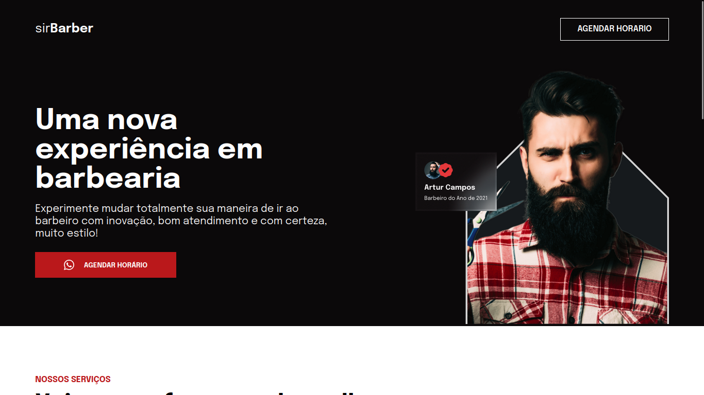

# Landing page barbearia

Uma landing page desenvolvida para praticar HTML e CSS, proporcionando uma experiência visual moderna e responsiva.

## 📁 Acesso ao projeto

[Veja o projeto final](https://barbearia-landing-page.netlify.app/).

## 🛠️ Abrir e rodar o projeto

Para abrir e rodar o projeto localmente, siga os passos abaixo:

Faça o download ou clone este repositório.
Abra o arquivo index.html em um navegador de sua escolha.
Não é necessário instalar dependências ou configurar um ambiente adicional.

### Contatos
Caso queira acompanhar mais projetos ou entrar em contato comigo, siga-me nas redes sociais:

